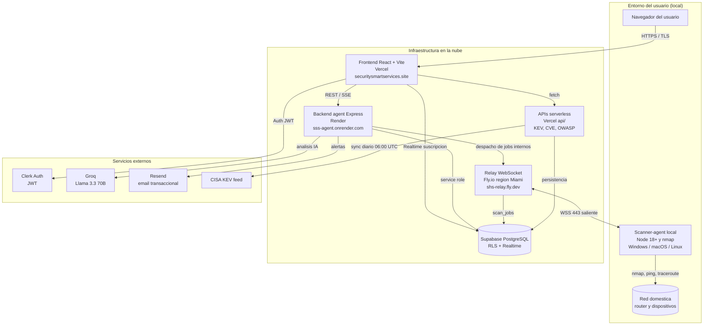

# Plan de Despliegue de Infraestructura

## Portada

| Campo | Detalle |
|-------|---------|
| Universidad | Universidad Iberoamericana (UNIBE) |
| Asignatura | TI3631-01-2026-3 Proyecto Integrador II |
| Semana | Semana 6 |
| Actividad | Actividad 5: Plan de Despliegue de Infraestructura |
| Proyecto | S.S.S - Security Smart Services |
| Dominio | securitysmartservices.site |
| Fecha | 20 de junio de 2026 |

Integrantes del grupo:

- ELMER MANUEL GONZALEZ OTAÑO
- LUCA SITA RINCON
- OSCAR OSNARCI JIMENEZ PEGUERO
- PEDRIBEL PION RIJO

---

## Indice

1. Descripcion de la infraestructura
2. Entornos definidos
3. Requerimientos tecnicos
4. Diagrama de arquitectura de despliegue
5. Procedimiento de despliegue
6. Medidas de seguridad
7. Anexos: normas y cumplimiento
8. Cobertura de criterios de evaluacion

---

## 1. Descripcion de la infraestructura

S.S.S (Security Smart Services) es una plataforma de auditoria y monitoreo de seguridad de redes domesticas y de pequenas empresas. Permite escanear la red por lenguaje natural, analizar los hallazgos con IA y enviar alertas automatizadas, sin que el servicio en la nube tenga acceso directo a la red privada del usuario.

### 1.1. Entorno de funcionamiento

El sistema funciona en un esquema **hibrido**:

- **Nube**: aloja el frontend, el backend, el relay de comunicaciones, las APIs serverless y la base de datos. Es la capa siempre disponible y de cara al usuario.
- **Local**: el agente de escaneo (scanner-agent) corre dentro de la red del usuario, en una de sus maquinas. Es la unica pieza con permiso para escanear la red, y el usuario la controla.

La razon del modelo hibrido es tecnica y de privacidad: para auditar una red privada hay que estar dentro de ella, y un servicio en la nube no puede alcanzar dispositivos detras del router. El agente local resuelve esto manteniendo solo conexiones salientes (WSS sobre puerto 443), de modo que no abre puertos ni requiere reglas de firewall especiales.

### 1.2. Componentes fisicos y virtuales

Componentes virtuales (nube):

- Hosting de frontend en Vercel (build estatico Vite servido por CDN).
- Instancia de backend agent (Express) en Render.
- Maquina virtual del relay WebSocket en Fly.io (1 vCPU compartido, 256 MB RAM, region Miami).
- Proyecto Supabase (PostgreSQL gestionado, Realtime y RLS).
- Funciones serverless en Vercel (carpeta `api/`: sincronizacion KEV, CVE, OWASP, verificacion de contrasenas comprometidas).

Componentes fisicos (lado del usuario):

- Maquina del usuario donde corre el agente: PC, mini-PC o servidor casero, con Node.js 18 o superior y nmap instalado.
- Router y dispositivos de la red domestica que son objeto de la auditoria.
- Conexion a internet con salida HTTPS/WSS por el puerto 443.

---

## 2. Entornos definidos

### 2.1. Separacion de ambientes (dev / QA / prod)

| Aspecto | Desarrollo (dev) | Pruebas (QA) | Produccion (prod) |
|---------|------------------|--------------|-------------------|
| Ubicacion frontend | Local, `npm run dev` (Vite en :8080) | Preview deploy de Vercel por rama | Vercel, securitysmartservices.site |
| Backend agent | Local, `npm run dev` (:3001) | Instancia de staging en Render | Render (sss-agent.onrender.com) |
| Relay | Local (`npm run dev`, :8080) | App de prueba en Fly.io | Fly.io (shs-relay.fly.dev) |
| Base de datos | Proyecto Supabase de desarrollo | Proyecto Supabase de staging | Proyecto Supabase de produccion |
| Agente local | Binario o `npm run start` en la maquina del dev | Binario de prueba emparejado a cuenta QA | Binario publicado, instaladores oficiales |
| Datos | Datos ficticios | Datos de prueba controlados | Datos reales de usuarios |
| Acceso | Solo el desarrollador | Equipo (4 integrantes) | Equipo con permisos restringidos |

Nota sobre el tier gratuito: por las limitaciones del free tier de Supabase, dev y QA comparten un mismo proyecto Supabase (con datos separados por usuario y RLS), mientras que produccion usa un proyecto Supabase independiente. De igual forma, el backend en Render (free) hiberna tras 15 minutos de inactividad, por lo que el keep-alive y el cron externo de uptime tambien ayudan a mantenerlo activo en produccion.

### 2.2. Herramientas por entorno

| Categoria | Herramienta | Uso |
|-----------|-------------|-----|
| Control de versiones | Git + GitHub (con submodulos) | Codigo, ramas, releases del agente |
| CI/CD frontend | Vercel | Build automatico, previews por rama, deploy a prod |
| Deploy backend | Render | Despliegue del agent Express |
| Deploy relay | Fly.io / flyctl | Despliegue y secrets del relay |
| Base de datos | Supabase CLI y SQL Editor | Migraciones 001 a 006, RLS, Realtime |
| Contenedores | Docker (node:20-alpine) | Empaquetado del relay y del agente |
| Proceso en servidor | PM2 o systemd (si aplica en VPS) | Mantener procesos vivos |
| Toolchain | npm 9+, tsc, vite, tsx | Build y ejecucion local |
| Monitoreo de uptime | UptimeRobot / cron-job.org | Pings externos al endpoint de salud |

---

## 3. Requerimientos tecnicos

### 3.1. Recursos minimos por entorno

| Entorno / componente | CPU | RAM | Disco | Conectividad |
|----------------------|-----|-----|-------|--------------|
| Relay (Fly.io) | 1 vCPU compartido | 256 MB | Efimero (stateless) | HTTPS/WSS 443, force_https |
| Backend agent (Render free) | 0.5 vCPU | 512 MB | Efimero (hiberna a los 15 min) | HTTPS saliente y entrante |
| Frontend (Vercel) | Servido por CDN | No aplica | Estatico (dist/) | HTTPS publico |
| Base de datos (Supabase free) | Gestionado | Tier free | 500 MB | TLS, pooler |
| Agente local | 1 nucleo | ~150 MB | ~200 MB (binario + nmap) | Salida HTTPS/WSS 443 |
| Estacion de desarrollo | 2 nucleos | 8 GB recomendado | 2 GB libres | Internet |

Nota: tanto Render como Supabase operan en tier gratuito. Render hiberna el backend tras 15 minutos sin trafico (arranque en frio en la siguiente peticion) y Supabase pausa el proyecto tras ~7 dias de inactividad; ambos riesgos se mitigan con el keep-alive interno y el cron externo de uptime descritos en la seccion 6.

### 3.2. Sistemas operativos y versiones

| Componente | Sistema operativo | Version |
|------------|-------------------|---------|
| Relay y agente backend (contenedor) | Linux Alpine | node:20-alpine |
| Frontend y APIs serverless | Linux (gestionado por Vercel) | Plataforma Vercel |
| Backend en Render | Linux (gestionado) | Plataforma Render |
| Base de datos | Linux (gestionado por Supabase) | PostgreSQL |
| Agente local | Windows | 10 / 11 |
| Agente local | macOS | Soportado (binario) |
| Agente local | Linux | Distros con Node 18+ |
| Maquinas del equipo | Windows | 11 |

### 3.3. Frameworks, lenguajes, dependencias y versiones

| Capa | Tecnologia | Version |
|------|------------|---------|
| Lenguaje | TypeScript | 5.8 (strict) |
| Runtime | Node.js | >= 18 (alpine 20 en contenedores) |
| Frontend | React | 18.3 |
| Frontend build | Vite | 5.4 |
| UI | Tailwind CSS | 3.4 |
| UI componentes | shadcn/ui (Radix UI) | varios |
| Estado / datos | TanStack React Query | 5.x |
| Backend | Express.js | 4.21 |
| Base de datos cliente | @supabase/supabase-js | 2.49 |
| Autenticacion | Clerk (react 6.7, express 2.1) | 6.x / 2.x |
| IA | Groq SDK (Llama 3.3 70B) | 0.7 |
| Email | Resend | 4.0 |
| Tareas programadas | node-cron | 3.0 |
| Validacion | Zod | 3.x |
| Dependencia de sistema | nmap | instalada en la maquina del agente |

---

## 4. Diagrama de arquitectura de despliegue

### 4.1. Herramienta de diagramado

Se utiliza **Mermaid**, porque se versiona junto al codigo en el repositorio (`docs/diagrama-arquitectura.mmd`), se renderiza en GitHub y se puede exportar a imagen para el documento Word y la presentacion.

### 4.2. Descripcion textual del diagrama

El usuario accede desde su navegador al frontend en Vercel mediante HTTPS. El frontend se autentica con Clerk (JWT), consume el backend agent en Render por REST y SSE, recibe actualizaciones en tiempo real de Supabase (Realtime) y consulta las APIs serverless de Vercel. El backend agent escribe en Supabase con su service role, pide analisis de IA a Groq, envia alertas por correo con Resend y despacha jobs internos al relay en Fly.io. El relay mantiene un WebSocket seguro (WSS, salida por el puerto 443) con cada scanner-agent instalado en la maquina del usuario y persiste los resultados (`scan_jobs`) en Supabase. El agente local es quien ejecuta nmap, ping y traceroute contra el router y los dispositivos de la red domestica. En paralelo, las APIs serverless sincronizan a diario el feed KEV de CISA y guardan los datos en Supabase.

### 4.3. Diagrama (Mermaid)



---

## 5. Procedimiento de despliegue

### 5.1. Pasos de configuracion inicial (orden exacto)

1. **Base de datos**: crear el proyecto en Supabase. En el SQL Editor ejecutar las migraciones en orden: `001_enums_and_profiles.sql`, `002_core_tables.sql`, `003_reports_and_scheduling.sql`, `004_notifications.sql`, `005_scan_results.sql`, `006_realtime_and_rls.sql`. Verificar que Realtime y RLS quedan activos.
2. **Autenticacion**: configurar la aplicacion en Clerk y obtener las claves publicas y secretas.
3. **Backend agent (Render)**: conectar el repositorio, definir variables de entorno (`SUPABASE_URL`, `SUPABASE_SERVICE_ROLE_KEY`, `GROQ_API_KEY`, `RESEND_API_KEY`, `RESEND_FROM_EMAIL`, `AGENT_ALLOWED_ORIGIN`, `AGENT_INTERNAL_SECRET`, `RELAY_INTERNAL_SECRET`), compilar con `npm run build` y arrancar con `npm run start`.
4. **Relay (Fly.io)**:
   ```bash
   flyctl launch --no-deploy --name shs-relay --region mia
   flyctl secrets set SUPABASE_URL=... SUPABASE_SERVICE_ROLE_KEY=... RELAY_INTERNAL_SECRET=$(openssl rand -hex 32)
   flyctl deploy
   ```
5. **Frontend (Vercel)**: importar el repositorio, definir variables (`VITE_SUPABASE_URL`, `VITE_SUPABASE_ANON_KEY`, `VITE_AGENT_URL`, claves de Clerk), confirmar `vercel.json` (framework vite, `buildCommand` `npm run build`, `outputDirectory` `dist`, rewrites a Render). Hacer deploy a produccion.
6. **Instaladores y agente**: publicar `install.sh`, `install.ps1`, `uninstall.sh`, `uninstall.ps1` en el dominio y generar el release de binarios del scanner-agent (`npm run package:all`).
7. **Onboarding del usuario**: el usuario instala el agente (`iwr .../install.ps1 | iex` en Windows o `curl -fsSL .../install.sh | sh` en macOS/Linux), genera un codigo en el dashboard y empareja con `shs-scanner pair <codigo>`, luego `shs-scanner start`. Validar con `shs-scanner doctor`.

### 5.2. Cronograma estimado por fases

El cuatrimestre inicio el 4 de mayo de 2026 y finaliza en la semana del 10 de agosto de 2026. El siguiente cronograma de despliegue se encuadra dentro de ese calendario y deja margen antes del cierre.

| Fase | Fechas | Actividades |
|------|--------|-------------|
| 1. Provisioning | 23 - 27 jun 2026 | Crear Supabase, migraciones 001 a 006, configurar Clerk |
| 2. Backend y relay | 30 jun - 4 jul 2026 | Deploy de Render y Fly.io, secrets, chequeos de salud |
| 3. Frontend e integracion | 7 - 11 jul 2026 | Deploy Vercel, rewrites, pruebas de extremo a extremo |
| 4. Agente e instaladores | 14 - 18 jul 2026 | Binarios, install scripts, emparejamiento |
| 5. QA y pruebas | 21 - 25 jul 2026 | Pruebas funcionales, seguridad, carga ligera |
| 6. Produccion y entrega | 28 jul - 8 ago 2026 | Salida a produccion, monitoreo y entrega final antes del cierre del cuatrimestre |

---

## 6. Medidas de seguridad

### 6.1. Roles y permisos

A nivel de aplicacion el sistema usa RBAC con tres roles (admin, normal, guest) sobre 9 secciones y 3 niveles de acceso (none, view, full), reforzado por Row Level Security (RLS) en PostgreSQL.

| Ambito | Quien accede | A que |
|--------|--------------|-------|
| App - admin | Cuentas administradoras | Todo + gestion de usuarios |
| App - normal | Usuarios estandar | La mayoria de secciones (segun permisos) |
| App - guest | Invitados | Solo lectura de dashboard y red |
| Infra dev | Cada integrante | Su entorno local y Supabase de desarrollo |
| Infra QA | Equipo (4 integrantes) | Paneles de staging |
| Infra prod | Equipo con permisos restringidos | Vercel, Render, Fly.io, Supabase de produccion |

La `service_role_key` de Supabase solo vive en el backend y el relay (nunca en el frontend). El frontend usa unicamente la anon key. El owner de los paneles cloud (Vercel, Render, Fly.io y Supabase) es Oscar Osnarci Jimenez Peguero, responsable de backend y despliegue del equipo; los demas integrantes acceden como colaboradores segun necesidad.

### 6.2. Respaldo y recuperacion ante fallos

| Elemento | Estrategia |
|----------|------------|
| Base de datos | El free tier de Supabase no incluye point-in-time recovery; se realizan exportaciones logicas periodicas (volcado SQL via Supabase CLI / `pg_dump`) almacenadas fuera de la plataforma como respaldo |
| Disponibilidad de Supabase | Keep-alive por cron interno cada 3 horas + ping externo de respaldo para evitar la pausa del free tier (~7 dias de inactividad) |
| Disponibilidad del backend | Render free hiberna a los 15 min; el cron externo de uptime lo mantiene despierto y reduce arranques en frio |
| Relay | Servicio stateless: si reinicia, los agentes reconectan en segundos |
| Codigo y config | Recuperacion por redeploy desde Git en Vercel, Render y Fly.io |
| Objetivos | RTO objetivo aproximado 1 hora, RPO objetivo aproximado 24 horas (limitado al free tier; mejora a minutos con PITR si se migra a tier pago) |

### 6.3. Cifrado y monitoreo

Cifrado en transito:

- HTTPS/TLS en frontend, backend y APIs serverless.
- WSS (WebSocket sobre TLS) entre el relay y los agentes, solo salida por el puerto 443.
- `force_https` activo en Fly.io.
- Cabeceras de seguridad en Vercel: `X-Content-Type-Options`, `X-Frame-Options`, `Referrer-Policy`, `Permissions-Policy`.

Cifrado en reposo:

- Cifrado de datos de PostgreSQL gestionado por Supabase.
- Secrets gestionados por la plataforma (Vercel env, Render env, Fly.io secrets); la `service_role_key` no se expone al cliente.

Monitoreo:

- Tabla `activity_logs` como pista de auditoria en la base de datos.
- Endpoint `/api/health` que reporta alcanzabilidad y latencia de la base de datos.
- Cron externo de uptime (UptimeRobot o cron-job.org) cada 3 a 4 horas.
- Logs de plataforma en Vercel, Render y Fly.io.
- Autenticacion basada en JWT a traves de Clerk.

Controles adicionales del scanner-agent: lista blanca de comandos y flags de nmap, sanitizacion de argumentos (sin `;`, `|`, `` ` ``, `$`), restriccion a redes privadas (192.168.x.x, 10.x.x.x, 172.16-31.x.x), rate limit de 5 escaneos por minuto, timeout de 60 segundos y usuario no-root en el contenedor.

---

## 7. Anexos: normas y cumplimiento

- **ISO/IEC 27001**: el plan se alinea con controles de gestion de accesos (A.5/A.8), criptografia, registro y monitoreo, y continuidad. El RBAC, la RLS, el cifrado en transito/reposo y la pista de auditoria sirven de soporte.
- **NIST SP 800-53**: controles aplicables de las familias AC (control de acceso), AU (auditoria y rendicion de cuentas), SC (proteccion de sistemas y comunicaciones) y CP (planificacion de contingencias y respaldos).
- **Ley 172-13 de Proteccion de Datos Personales (Republica Dominicana)**: dado que se procesan datos de usuarios y de su red, se contemplan principios de finalidad, consentimiento, seguridad y confidencialidad. El modelo en el que S.S.S no accede directamente a la red del usuario y el agente es controlado por este refuerzan la minimizacion de datos.

[PENDIENTE: confirmar si el curso exige evidencia formal de cumplimiento de alguna norma adicional].

---

## 8. Cobertura de criterios de evaluacion

| Criterio | Ponderacion | Donde se cubre |
|----------|-------------|----------------|
| Claridad y viabilidad de la infraestructura | 25% | Seccion 1 (entorno hibrido, componentes fisicos y virtuales) |
| Entornos y requerimientos tecnicos | 20% | Secciones 2 y 3 (tablas dev/QA/prod y requerimientos) |
| Procedimiento de despliegue | 20% | Seccion 5 (pasos y cronograma) |
| Diagrama tecnico | 15% | Seccion 4 (Mermaid + descripcion textual) |
| Seguridad y cumplimiento | 20% | Seccion 6 y Anexo 7 (cifrado, respaldo, roles, normas) |
